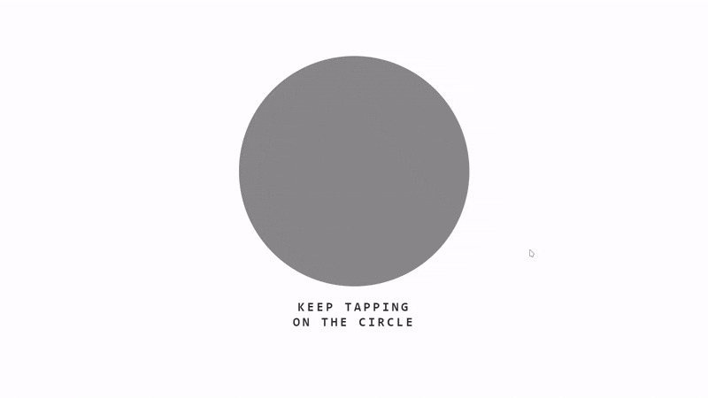

# Rickroll Puzzle

Welcome to the **Rickroll Puzzle** project! This is a fun and interactive website that rickrolls you after you solve a puzzle. 

## ✨ Preview



## 🚀 The Plan

The goal was to create an engaging experience where solving a puzzle would lead to an unexpected rickroll. The puzzle involves clicking on circles that multiply until a grid of 2500 circles (50x50) is formed, which then triggers the rickroll.

## 🛠 The Implementation

### Step 1: Click and Multiply

The puzzle starts with a single circle. As you click on it, the number of circles doubles each time until the screen is filled with 2500 circles.

```html
<body>
  <div class="box clickable" id="1">
    <div class="circle" id="0"></div>
  </div>
  <h3 id="banner">KEEP TAPPING <br> ON THE CIRCLE</h3>
  <script src="script.js"></script>
</body>
```

### Step 2: Doubling Circles with JavaScript

JavaScript is used to double the number of circles on each click until the maximum of 2500 circles is reached.

```javascript
var box = document.getElementsByClassName("clickable")[0];
var count = parseInt(box.id);
const max = 2500;

box.onclick = function () {
  if (count <= max) {
    var num = count == 1 ? 1 : count * 2 > max ? (max - count) : count * 2;
    for (var i = 0; i < num ; i ++) { addCircle() }
    box.id = num;
    if (count != 1) {
      box.style.gridTemplateColumns = `repeat(${Math.ceil(Math.sqrt(count))}, 1fr)`;
    }
    if (count >= max) {
      box.style.gridTemplateColumns = "repeat(50, 1fr)";
      box.id = "full";
      box.onclick = null;
    }
  }
};
```

### Step 3: Adding Circles

A new circle is added each time the function `addCircle()` is called.

```javascript
function addCircle() {
  var circle = document.createElement('div');
  circle.className = 'circle';
  circle.id = count;
  box.appendChild(circle);
  box.id = count++;
}
```

### Step 4: Rickroll Animation

Once the grid is filled, a Rick Astley dancing animation (using a sprite sheet) is triggered, perfectly matching the 50x50 grid dimensions.

```javascript
box.onclick = function () {
  var img_obj = {
    'source': null,
    'current': 0,
    'total_frames': 52,
    'width': 50,
    'height': 50
  };

  const img = new Image();
  img.onload = function () {
    img_obj.source = img;
  }

  img.src = "./data/ricksprite.png";

  const canvas = document.createElement('canvas');
  canvas.width = 50;
  canvas.height = 50;
  var context = canvas.getContext("2d");
  setInterval(function () { rickRoll(canvas, context, 0, 0, img_obj) }, 100);

  var banner = document.getElementById('banner');
  banner.innerHTML = "YOU'VE BEEN RICKROLLED!";
  box.onclick = null;
};
```

### Step 5: Rendering Animation

The function `rickRoll()` handles the rendering of the animation on the grid.

```javascript
function rickRoll(canvas, context, x, y, iobj) {
  clearBox();
  if (iobj.source != null){
    context.drawImage(iobj.source, iobj.current * iobj.width, 0, iobj.width, iobj.height, x, y, iobj.width, iobj.height);
  }

  iobj.current = (iobj.current + 1) % iobj.total_frames;

  for (let y = 0; y < canvas.height; y++) {
    for (let x = 0; x < canvas.width; x++) {
      let data = context.getImageData(x, y, 1, 1).data;
      if (data[0] <= 20 && document.getElementById(((y+1) * 50 + x + 1).toString())) {
        document.getElementById(((y+1) * 50 + x + 1).toString()).classList.add("dark");
      }
    }
  }
}
```

### Step 6: Resetting Circles

The `clearBox()` function resets the circles by removing any darkened elements.

```javascript
function clearBox() {
  let elems = document.getElementsByClassName("dark");
  for (let i = 0; i < elems.length; i++) {
    elems[i].classList.remove("dark");
  }
}
```

## 🎉 Rickroll in Style!

You can try the rickroll puzzle by visiting the [Rickroll Puzzle](https://rollwithrick.vercel.app) link.

Thanks for checking out the project!